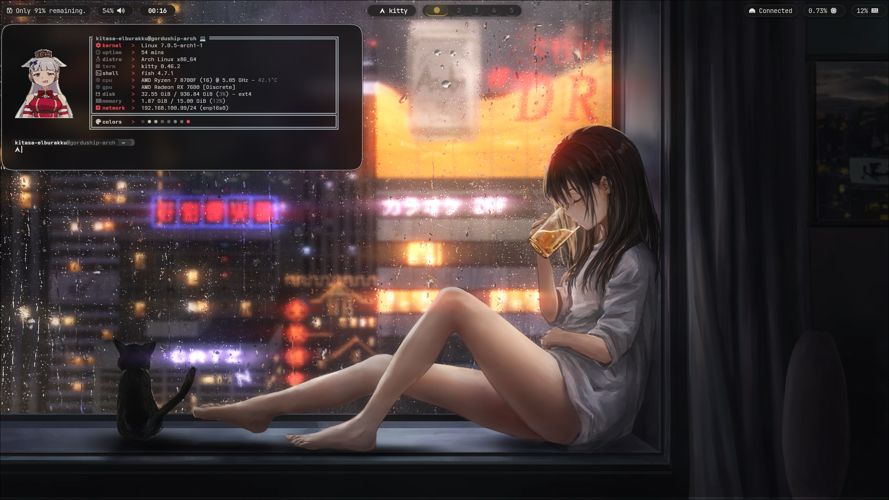
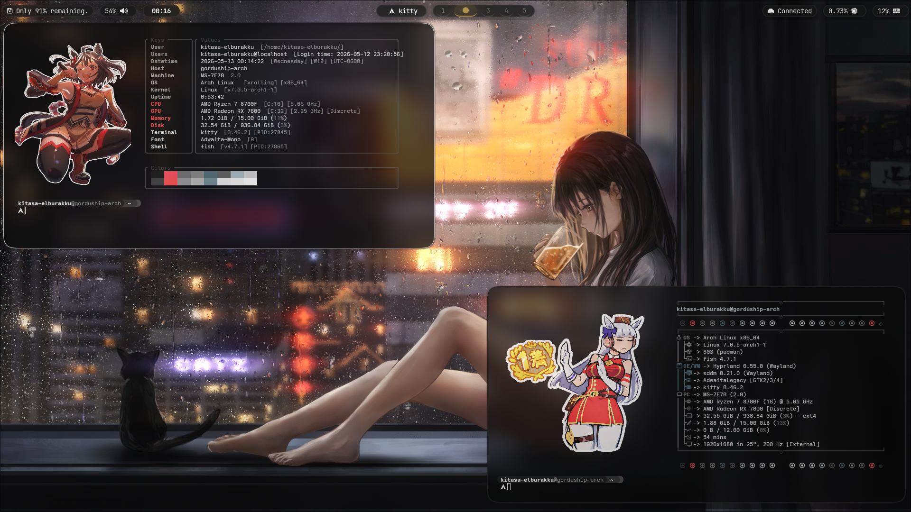
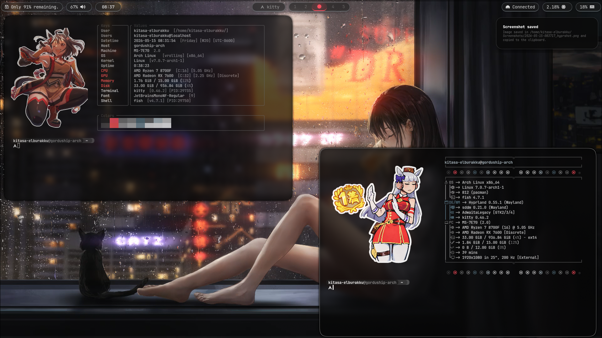
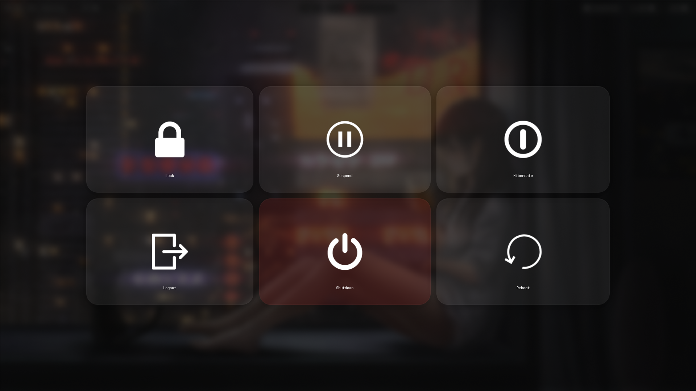

# 🌌 Silent Orbit — Hyprland Rice

> *“A silent terminal orbiting a dead star.”*

Silent Orbit is a minimal and atmospheric Hyprland rice built around dark translucent visuals, capsule-style UI elements, floating terminal utilities and smooth workflows.

The goal of this setup is simplicity without losing personality:
clean visuals, lightweight performance and a cinematic late-night feeling.

---
# 📸 Preview








---
# ✨ Features

- Minimal monochrome aesthetic
- Capsule-style Waybar design
- Floating Cava visualizer
- Keyboard navigable Wlogout
- Smooth rounded UI elements
- Dark translucent glassmorphism
- Lua-based Hyprland configuration
- Lightweight modular structure
- Blur-focused atmospheric design

---

# 🛠️ Environment

| Component | Software |
|---|---|
| OS | Arch Linux |
| WM | Hyprland |
| Terminal | Kitty |
| Bar | Waybar |
| Logout Menu | Wlogout |
| Visualizer | Cava |
| Launcher | Wofi |
| Shell | Bash |
| Font | JetBrainsMono Nerd Font |

# 🎵 Design Philosophy

Silent Orbit focuses on:
- silence over visual noise
- readability over clutter
- atmosphere over RGB overload

This rice is heavily inspired by:
- cyberpunk environments
- rainy neon aesthetics
- minimal Linux setups
- quiet late-night coding sessions

The UI is designed to feel like:

> a quiet apartment window during a rainy cyberpunk night.

# ⌨️ Keybind Highlights

| Keybind | Action |
|---|---|
| `SUPER + Enter` | Open terminal |
| `SUPER + Q` | Close active window |
| `SUPER + R` | Open launcher |
| `SUPER + SHIFT + D` | Toggle Cava |
| `SUPER + SHIFT + C` | Kill Cava |
| `SUPER + W` | Open browser |

# 🚀 Installation

Clone the repository:

```bash
git clone https://github.com/kitasael-burakku/Silent-Orbit-Hyprland-Rice-Gorushi.git
```

Move the configuration files:

```bash
cp -r Silent-Orbit-Hyprland-Rice-Gorushi/.config ~/
```

Reload Hyprland:

```bash
hyprctl reload
```

---

# 🎶 Cava Integration

Cava is intentionally separated from Waybar.

Instead of permanently occupying bar space, it works as a floating atmospheric visualizer toggled through a keybind.

Example:

```bash
pgrep cava && pkill cava || kitty --class cava-float cava
```

---

# 🌑 Wlogout

Custom Wlogout theme with:
- rounded capsule buttons
- keyboard navigation support
- smooth hover animations
- dark translucent background

---

# 🎨 Theme

The entire setup uses:
- dark grayscale tones
- subtle transparency
- soft shadows
- rounded borders
- minimal visual distractions

No heavy RGB.
No excessive widgets.
Just atmosphere.

---

# 📜 License

This project is licensed under the MIT License.

---

# 🤍 Credits

Inspired by:
- Hyprland community
- minimalist Linux rices
- cyberpunk aesthetics
- late-night terminal sessions

---

# ⭐ Support

If you like the project, consider starring the repository.

The void eventually stares back.
